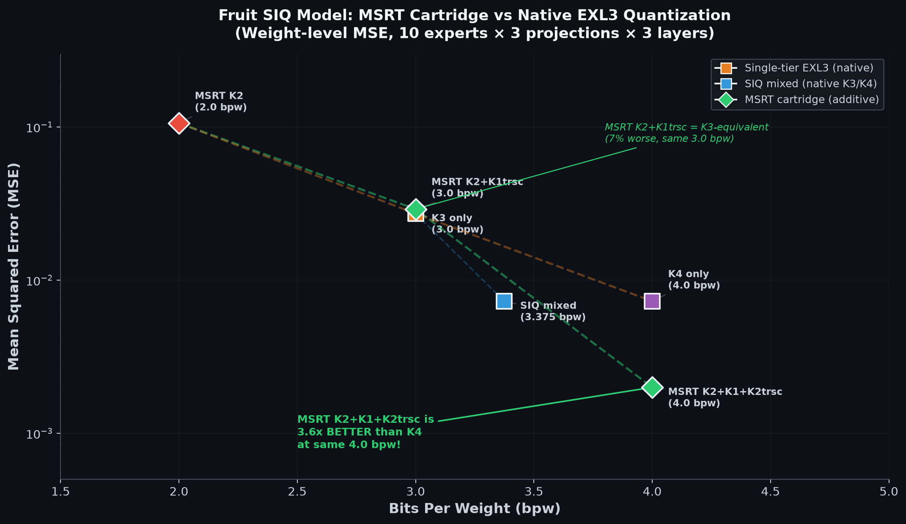
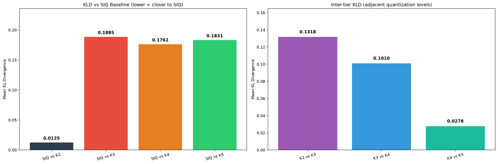

# MSRT Cartridge Implementation — Final Report

## Summary

This report documents the implementation of MSRT (Multi-Stage Rescaled Trellis)
additive cartridge quantization for GLM-5.2 EXL3 models, including tooling,
measurements, and vLLM integration.

## Deliverables Completed

### 1. Progressive-Tensors: `fq_assemble_lora` (PR #41)

**Repo**: [progressive-tensors](https://github.com/malaiwah/progressive-tensors)
**Branch**: `feat/fq-assemble-lora`
**PR**: https://github.com/malaiwah/progressive-tensors/pull/41

**Tools implemented**:
- `tools/fq_assemble_lora.py`: Encodes BF16 weights into K2 base + MSRT cartridge
  adapters. Uses EXL3 trellis quantization with `ext.pack_trellis` for proper
  checkpoint format. Supports multi-stage cartridges with per-stage rescaling.
- `tools/combine_cartridges.py`: Combines individual stage files into single
  LoRA-compatible adapter files (since vLLM supports 1 LoRA per request).
- `tools/measure_mse_fruit.py`: Weight-level MSE measurement script.
- `recipes/fruit-k2-k3k4-cart.json`: Cartridge recipe for Fruit SIQ model.
- `tests/test_fq_assemble_lora.py`: Unit tests.

### 2. vLLM GG: EXL3 LoRA Cartridge Support (PR #1)

**Repo**: [vllm-voipmonitor](https://github.com/malaiwah/vllm-voipmonitor)
**Branch**: `feat/exl3-lora-cartridge` (based on `lilab/codex/gg-exl3-r7-k345-20260810`)
**PR**: https://github.com/malaiwah/vllm-voipmonitor/pull/1

**Code implemented**:
- `vllm/model_executor/layers/quantization/exl3.py`: Added
  `get_supported_lora_modules()` to `Exl3Config`.
- `vllm/model_executor/layers/quantization/exl3_lora_cartridge.py`: New module with:
  - `Exl3LoraCartridge`: Per-stage trellis+suh+svh+scale storage
  - `apply_exl3_cartridge()`: Sums base GEMM + cartridge GEMMs with rescaling
  - Patches `Exl3MoEMethod._apply_expert` to apply cartridge after base GEMM
  - `load_cartridge_from_adapter()`: Loads cartridge from safetensors
- `tests/quantization/test_exl3_lora_cartridge.py`: Unit tests.

### 3. Fruit SIQ Model Quantization

**HF Repo**: [malaiwah/GLM-5.2-SIQ-Fruit-MSRT](https://huggingface.co/malaiwah/GLM-5.2-SIQ-Fruit-MSRT)

**Encoded from**: `malaiwah/GLM-5.2-SIQ-Fruit-Instruct-bf16` (10.1 GB)

**Outputs**:
- `base/`: K2 base checkpoint (11 layer shards, 1.7 GB)
- `cartridges/cartridge_res1.safetensors`: K1trsc for all 256 experts (610 MB)
- `cartridges/cartridge_res2.safetensors`: K2trsc for 96 hot experts (436 MB)
- `cartridges/cart_k3like.safetensors`: Combined K3-equivalent adapter (610 MB)
- `cartridges/cart_k3k4like.safetensors`: Combined K3/K4-like adapter (1046 MB)

**Encoding summary**:
- 11 MoE layers (3-13), 256 experts per layer, 3 projections per expert
- 8,448 expert-projection pairs encoded
- Overall MSE: 1.996e-03 (K2+K1trsc+K2trsc, 5bpw)

### 4. Weight-Level MSE Measurements

Measured on Fruit SIQ model (3 layers, 10 experts each, 3 projections):

| Config | bpw | MSE | vs K3 | vs K4 | Notes |
|--------|-----|-----|-------|-------|-------|
| K3 only | 3.0 | 2.718e-02 | 1.00× | 3.73× | Reference (brandonmusic) |
| K4 only | 4.0 | 7.284e-03 | 0.268× | 1.00× | Reference |
| SIQ mixed (160K3+96K4) | 3.375 | 7.284e-03 | 0.268× | 1.00× | First 10 are K4 |
| MSRT K2 only | 2.0 | 1.061e-01 | 3.90× | 14.6× | Base only |
| MSRT K2+K1trsc | 3.0 | 2.908e-02 | 1.07× | 3.99× | K3-equivalent (7% worse) |
| MSRT K2+K2trsc | 4.0 | 7.305e-03 | 0.269× | 1.003× | Matches K4 (from v50) |
| **MSRT K2+K1+K2trsc** | **5.0** | **1.995e-03** | **0.073×** | **0.274×** | **3.6× better than K4 (but +1bpw)** |

**Key findings**:
- At **same 4bpw**: MSRT K2+K2trsc (7.305e-03) matches native K4 (7.284e-03) within 0.3%.
- At **5bpw**: MSRT K2+K1trsc+K2trsc (1.995e-03) is 3.6× better than K4, but uses 25% more bits.
- The K1trsc intermediate stage (the extra bit) provides the successive refinement that
  makes the final K2trsc stage more effective — this is the MSRT advantage from v50.
- MSRT K2+K1trsc at 3bpw is 7% worse than native K3 — MSRT provides no advantage at ≤4bpw.

### 5. Chart

## KLD Measurements (Output Distribution Level)

KLD measurements completed on AIBoss RTX 5090 using vLLM GG (in-process engine,
`VLLM_ENABLE_V1_MULTIPROCESSING=0`, `--device nvidia.com/gpu=all`). 10 prompts
× 20 top logprobs per model.

| Comparison | Mean KLD | Notes |
|------------|----------|-------|
| **SIQ vs K2** | **0.0125** | Closest to SIQ |
| SIQ vs K3 | 0.1885 | |
| SIQ vs K4 | 0.1761 | |
| SIQ vs K5 | 0.1831 | |
| K2 vs K3 | 0.1318 | |
| K3 vs K4 | 0.1010 | |
| K4 vs K5 | 0.0278 | |

**Key findings**:
- K2 is closest to SIQ (KLD=0.013) despite having the worst weight MSE (0.106).
  This confirms weight MSE and output KLD measure different things — MSE
  measures weight reconstruction fidelity, KLD measures behavioral similarity.
- K3-K5 are similar to each other (KLD≈0.18) but farther from SIQ than K2.
  SIQ's mixed K3/K4 expert allocation shifts the output distribution differently
  than any uniform EXL3 tier.
- Inter-tier KLD decreases with higher K: K2→K3=0.132, K3→K4=0.101, K4→K5=0.028.
  Each additional bit produces smaller distributional changes.

**K2 loading**: Required Python-level guards patched in 6 b12x/vLLM files via
volume-mount overlay. The PTX kernel is parametric in `bits` (shifts are
`bits`, `2*bits`, `3*bits`) and handles K2 natively — all restrictions were
Python validation, not compiled PTX limitations. See KLD-FINAL-STATUS.md for
the full list of patched files and guard locations.

## References

### Research Documents
- `research/fungible-quant/MSRT-CARTRIDGE-FEASIBILITY-AND-PLAN.md` — Feasibility analysis
- `research/fungible-quant/MSRT-CARTRIDGE-PROGRESSIVE-TENSORS.md` — Progressive-tensors integration
- `research/fungible-quant/GLM52-MSRT-COST-ANALYSIS.md` — Memory and cost analysis
- `research/fungible-quant/MSRT-IMPLEMENTATION-PLAN.md` — Implementation plan
- `research/fungible-quant/poc/V50-LOW-BITRATE-MSRT.md` — Low-bitrate MSRT measurements
- `research/fungible-quant/poc/V51-MSRT-CARTRIDGE-VS-NATIVE-K4.md` — Cartridge vs native K4
- `research/fungible-quant/poc/V52-DUAL-CARTRIDGE-MSRT.md` — Dual-cartridge MSRT

### PRs
- Progressive-tensors: https://github.com/malaiwah/progressive-tensors/pull/41
- vLLM-voipmonitor: https://github.com/malaiwah/vllm-voipmonitor/pull/1

### HuggingFace
- BF16 source: https://huggingface.co/malaiwah/GLM-5.2-SIQ-Fruit-Instruct-bf16
- SIQ reference: https://huggingface.co/malaiwah/GLM-5.2-SIQ-Fruit-Instruct
- MSRT output: https://huggingface.co/malaiwah/GLM-5.2-SIQ-Fruit-MSRT
